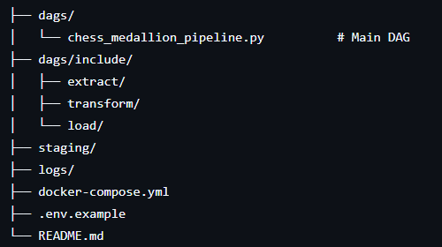
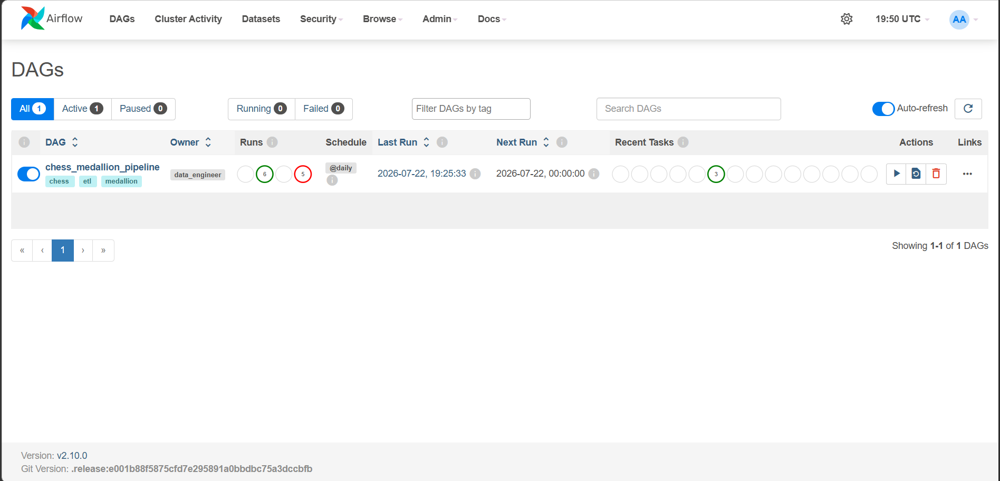
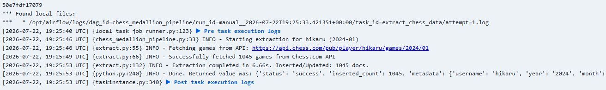
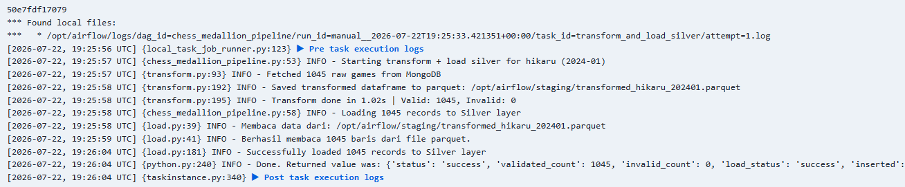
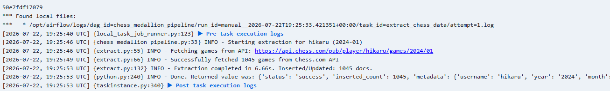
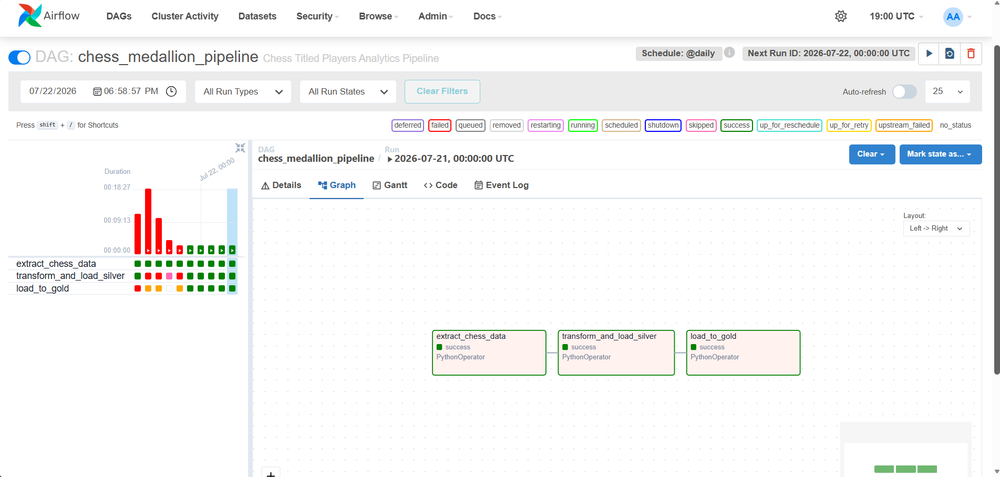
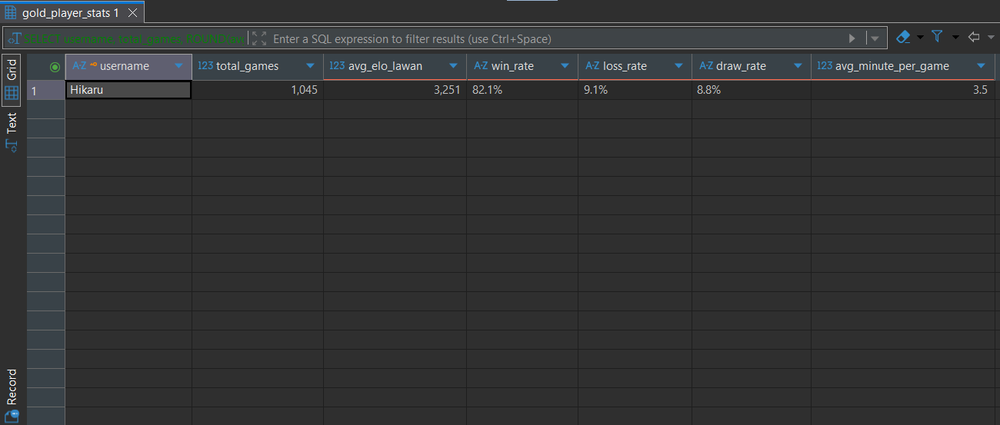
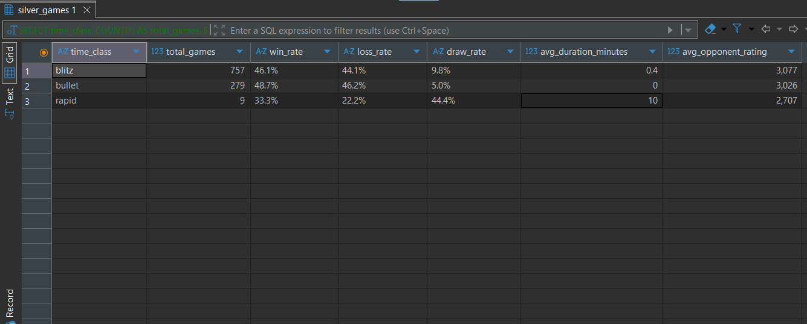
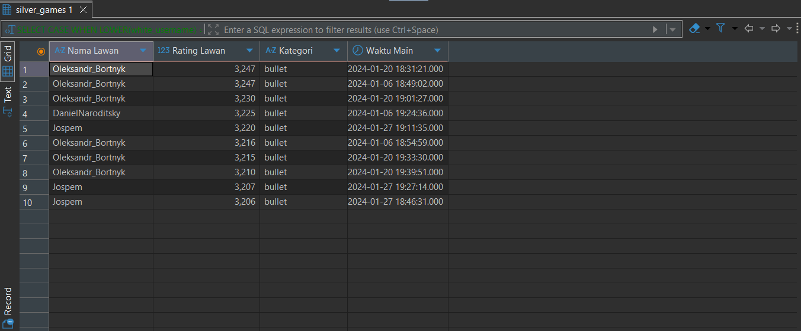

```markdown
# Chess Medallion Pipeline

An **ETL Pipeline** built with Apache Airflow implementing the **Medallion Architecture** (Bronze → Silver → Gold) for Chess.com game data.

This pipeline extracts chess games, performs data cleaning & transformation, and loads the data into Silver and Gold layers for analytics and reporting.

---

## ✨ Key Features

- **Parameterized Extraction**: Supports custom `username`, `year`, and `month`
- **Medallion Architecture**: Bronze → Silver → Gold layers
- **Robust Error Handling** with retries
- **Containerized** with Docker Compose (PostgreSQL + MongoDB)
- **Scalable** and production-ready DAG structure

---

## 🏗️ Medallion Architecture

```
Chess.com API
       ↓
[ Extract (Bronze) ]     → Raw game data
       ↓
[ Transform + Silver ]   → Cleaned & validated data
       ↓
[ Gold Layer ]           → Aggregated analytics tables
```

---

## 📁 Project Structure

```

```

---

## 🚀 How to Run

### 1. Clone & Setup

```bash
git clone <repository-url>
cd chess-medallion-pipeline
cp .env.example .env
```

### 2. Start Services

```bash
docker-compose up -d
```

### 3. Access Airflow UI

Go to: [http://localhost:8080](http://localhost:8080)  
**Username**: `airflow`  
**Password**: `airflow`

---

## 🔧 Triggering the Pipeline

The DAG supports **runtime configuration parameters**:

```python
def run_extract(**kwargs):
    ti = kwargs['ti']
    params = kwargs.get('params', {})
    username = params.get('username', 'hikaru')
    year = params.get('year', '2024')
    month = params.get('month', '01')
    
    logger.info(f"Starting extraction for {username} ({year}-{month})")
    result = extract_chess_games(username, year, month)
    ...
```

### How to Trigger with Custom Parameters

**Via Airflow UI:**
1. Go to the DAG `chess_medallion_pipeline`
2. Click **Trigger DAG**
3. Click **Run with config**
4. Use this JSON configuration:

```json
{
  "username": "magnuscarlsen",
  "year": "2025",
  "month": "06"
}
```

**Default values**: `username = 'hikaru'`, `year = '2024'`, `month = '01'`

---

## 📊 Airflow UI Screenshots

**1. DAG Overview**  


**2. Trigger DAG with Config**  




**3. Task Graph**  


*(Place your screenshots in `assets/screenshots/`)*

---

## 🗄️ Example Gold Layer SQL Queries

Main table: **`gold_player_stats`**

### 1. Player Match Statistic

```sql
SELECT 
    username, 
    total_games, 
    ROUND(avg_rating, 0) AS avg_elo_lawan,
    ROUND(win_rate::numeric * 100, 1) || '%' AS win_rate,
    ROUND(loss_rate::numeric * 100, 1) || '%' AS loss_rate,
    ROUND(draw_rate::numeric * 100, 1) || '%' AS draw_rate,
    ROUND(avg_duration_minutes, 1) AS avg_minute_per_game
FROM analytics.gold_player_stats
WHERE username = 'Hikaru';
```
result:


### 2. Player Detailed Time Class Match Statistic

```sql
SELECT 
    time_class,
    COUNT(*) AS total_games,
    ROUND(
        SUM(CASE WHEN outcome = 'win' THEN 1 ELSE 0 END)::NUMERIC / COUNT(*) * 100, 
        1
    ) || '%' AS win_rate,
    ROUND(
        SUM(CASE WHEN outcome = 'loss' THEN 1 ELSE 0 END)::NUMERIC / COUNT(*) * 100, 
        1
    ) || '%' AS loss_rate,
    ROUND(
        SUM(CASE WHEN outcome = 'draw' THEN 1 ELSE 0 END)::NUMERIC / COUNT(*) * 100, 
        1
    ) || '%' AS draw_rate,
    ROUND(AVG(duration_minutes), 1) AS avg_duration_minutes,
    ROUND(AVG(white_rating), 0) AS avg_opponent_rating
FROM analytics.silver_games
WHERE source_username = 'hikaru'  -- Ganti dengan username yang ingin dianalisis
GROUP BY time_class
ORDER BY total_games DESC;
```


### 3. Player Last Matchmaking (Win)

```sql
SELECT 
    CASE 
        WHEN LOWER(white_username) = 'hikaru' THEN black_username 
        ELSE white_username 
    END AS "Nama Lawan",
    CASE 
        WHEN LOWER(white_username) = 'hikaru' THEN black_rating 
        ELSE white_rating 
    END AS "Rating Lawan",
    time_class AS "Kategori",
    end_time AS "Waktu Main"
FROM analytics.silver_games
WHERE LOWER(source_username) = 'hikaru'
  AND (
      (LOWER(white_username) = 'hikaru' AND outcome = 'win')
      OR 
      (LOWER(black_username) = 'hikaru' AND outcome = 'loss')
  )
ORDER BY "Rating Lawan" DESC
LIMIT 10;
```

---

## 🛠️ Technologies

- **Apache Airflow** – Orchestration
- **PostgreSQL** – Gold Layer
- **MongoDB** – Silver Layer
- **Python** – ETL scripts
- **Docker** – Deployment

---

## 📋 Environment Variables

| Variable                        | Description                          | Default             |
|--------------------------------|--------------------------------------|---------------------|
| `POSTGRES_USER`                | Postgres username                    | airflow            |
| `POSTGRES_PASSWORD`            | Postgres password                    | airflow            |
| `MONGO_INITDB_ROOT_USERNAME`   | MongoDB root user                    | admin              |
| `CHESS_API_BASE_URL`           | Chess.com API URL                    | https://api.chess.com |
| `MAX_RETRIES`                  | API retry attempts                   | 3                  |
| `BATCH_SIZE`                   | Insert batch size                    | 1000               |

---

## 🔄 Pipeline Tasks

- `extract_chess_data` → Extract games using parameters
- `transform_and_load_silver` → Transform & load to Silver
- `load_to_gold` → Build aggregated Gold tables

---

## 📌 Notes

- Pipeline is scheduled daily (`@daily`)
- Designed for titled chess players data
- Easily extensible for more players and time ranges

---

**Built with ❤️ for Chess Analytics**
```
